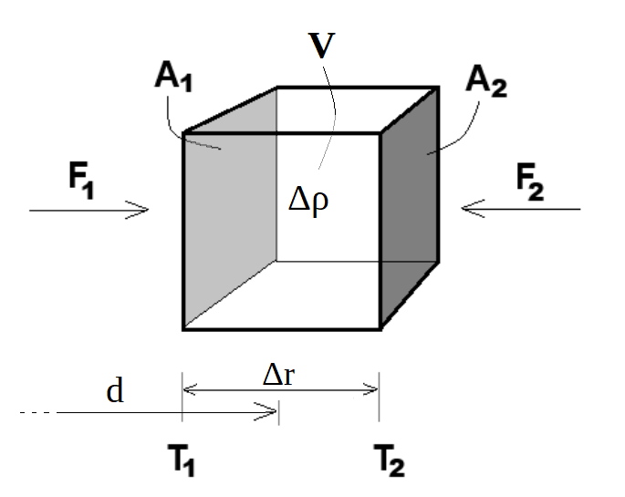
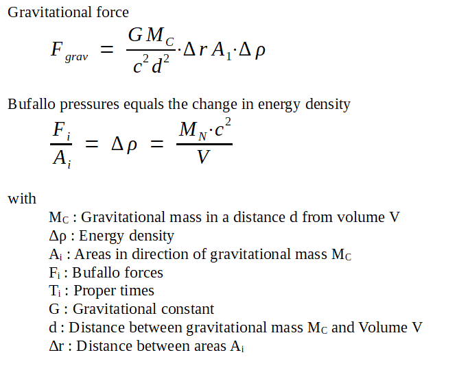
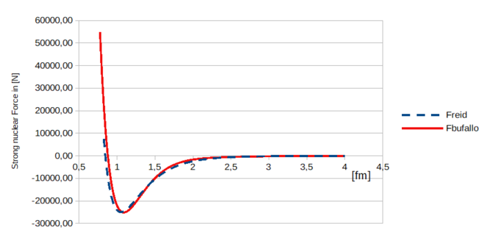
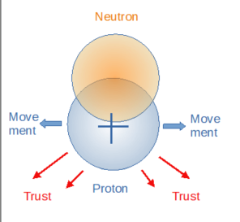

# The Bufallo Field
This repository contains documentation and software related to the Bufallo Field.

The Bufallo field is a strong momentum field that encompasses all massive particles.
The strong nuclear force and the gravitational force can be derived from it.

## Key words
Quantum gravity, strong nuclear force, Bufallo Field, Bufallo, Bufallo Booster, Reid profile, Schwarzschild metric,

## Description
The document 'The Bufallo Field.pdf' explains how to derive the gravitational and strong nuclear forces from the Bufallo Field, a strong momentum field.

The massive particles are energy clouds and can be approximated by cubes of constant energy density. The energy clouds are under strong pressure from the Bufallo field. In a gravitational field, the proper time of the areas further away from the center of gravity passes more quickly. Therefore, the pressure on this side is slightly greater. See the following sketch of a volume V with constant energy denity.

From the Schwarzschild metric, the difference in proper time across the volume V and the following formula for gravitational force and Bufallo pressures can be derived.

The software in the subfolder './soft/BufalloField/' provides a function to calculate the strong nuclear forces between two neutrons and recalculates the Reid profile.
There is already a calculated file './soft/BufalloField/StrongForces.csv' that can be imported into Excel or other spreadsheets.
Libre Office users can take the file  './soft/BufalloField/StrongForces.ods'
 

The following diagram shows the curve of the strong nuclear force Freid between two neutrons relative to their distance from each other, as well as the curve recalculated Fbufallo from the Bufallo field. 

## The Bufallo Booster

Knowing about the Bufallo field means looking for a way to manipulate it.
The Bufallo field offers the possibility of initiating thrust and repelling oneself from it, thereby building a motor that can convert energy into thrust without propellants — a Bufallo Booster® (patent pending).

One way to do this is based on asymmetrical atomic nuclei, such as that of deuterium. It consists of a neutron and a proton. Directly influencing atomic nuclei requires very strong electromagnetic fields. It is therefore easier to go via the electron shell surrounding the atomic nucleus. And since an atom is electrically neutral on its own, ions or atoms bound in a molecule with dipole properties are ideal. These can be set in motion relatively easily using electromagnetic fields. Heavy water D2O would therefore be a suitable molecule.

The neutron should remain relatively stationary due to its inertia, while the proton beneath it moves in all possible directions. The downward-facing flanks of the proton work against the pressure of the Bufallo field and push it downwards, so to speak, causing the proton to be pushed upwards.

## Installation
If github is already installed, open a command line window and 
enter the following:

  git clone https://github.com/hartwin2409/TheBufalloField
